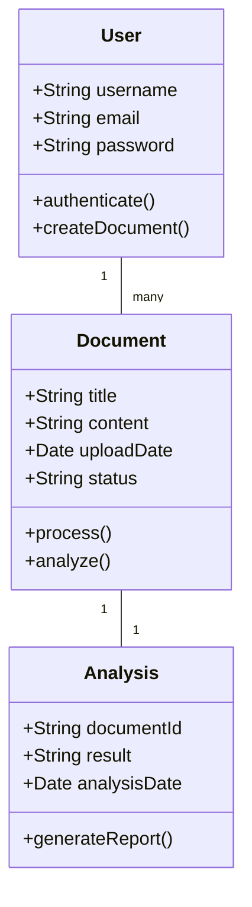
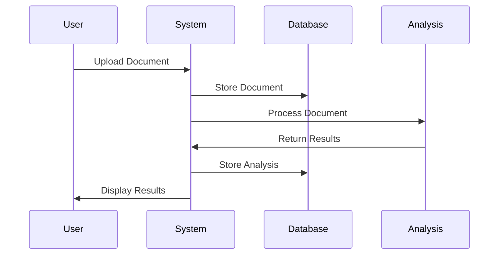
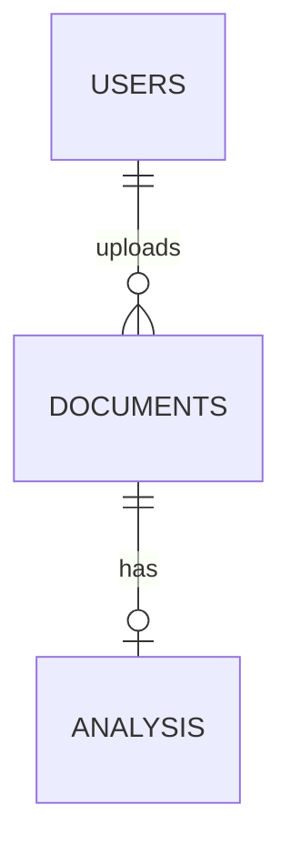

# Chapter 4: Design Phase

## 4.1 Introduction
This chapter presents the detailed design of the Legal Backend System, a comprehensive solution for legal document management and analysis. The system is designed to provide efficient document processing, analysis, and management capabilities for legal professionals. The design phase encompasses architectural decisions, system components, database structure, and interface design to ensure a robust and user-friendly system.

## 4.2 Architectural Design
The system follows a modern three-tier architecture:
1. **Frontend Layer**: React-based single-page application
2. **Backend Layer**: Django REST Framework API
3. **Database Layer**: SQLite (development) / PostgreSQL (production)

### Technology Stack:
- Frontend: React, Vite, TypeScript
- Backend: Django, Django REST Framework
- Database: SQLite/PostgreSQL
- Authentication: JWT-based authentication
- API Documentation: Swagger/OpenAPI

## 4.3 System Design

### 4.3.1 Context Diagram
```
[Legal Professional] ---> [Legal Backend System] ---> [External Legal Services]
        |                           |
        |                           |
        v                           v
[Document Storage] <------------ [Analysis Results]
```

### 4.3.2 DFD (Level 0)
```
[Legal Professional] ---> [Document Upload] ---> [Document Processing] ---> [Analysis Engine] ---> [Results Storage]
        |                           |                    |                        |
        |                           v                    v                        v
        +------------------------> [Document Management] <------------------- [Report Generation]
```

### 4.3.3 Class Diagram


### 4.3.4 Sequence Diagram


## 4.4 Physical Design
### Hardware Requirements:
- Server: Minimum 4GB RAM, 2 CPU cores
- Client: Modern web browser
- Storage: Minimum 100GB for document storage

### Software Requirements:
- Operating System: Linux/Windows Server
- Web Server: Nginx
- Application Server: Gunicorn
- Database Server: PostgreSQL
- Development Tools: VS Code, Git

## 4.5 Database Design

### 4.5.1 Tables

#### Users Table
Description: Stores user authentication and profile information
```sql
CREATE TABLE users (
    id INTEGER PRIMARY KEY,
    username VARCHAR(150) UNIQUE,
    email VARCHAR(254) UNIQUE,
    password VARCHAR(128),
    created_at TIMESTAMP
);
```

#### Documents Table
Description: Stores uploaded legal documents and their metadata
```sql
CREATE TABLE documents (
    id INTEGER PRIMARY KEY,
    title VARCHAR(200),
    content TEXT,
    user_id INTEGER,
    upload_date TIMESTAMP,
    status VARCHAR(50),
    FOREIGN KEY (user_id) REFERENCES users(id)
);
```

#### Analysis Table
Description: Stores analysis results for documents
```sql
CREATE TABLE analysis (
    id INTEGER PRIMARY KEY,
    document_id INTEGER,
    result TEXT,
    analysis_date TIMESTAMP,
    FOREIGN KEY (document_id) REFERENCES documents(id)
);
```

### 4.5.2 Enhanced Entity Relationship Diagram


## 4.6 Interface Design

### 4.6.1 Menu Design

#### 4.6.1.1 Main Menu
- Dashboard
- Documents
- Analysis
- Reports
- Settings

#### 4.6.1.2 Sub-menus
- Documents
  - Upload
  - View All
  - Search
- Analysis
  - New Analysis
  - View Results
- Reports
  - Generate Report
  - View History

### 4.6.2 Input Forms

1. **Document Upload Form**
   - File selection
   - Document metadata input
   - Category selection
   - Priority setting

2. **Analysis Configuration Form**
   - Analysis type selection
   - Parameters configuration
   - Schedule settings

3. **User Profile Form**
   - Personal information
   - Preferences
   - Notification settings

### 4.6.3 Output Forms

1. **Analysis Results Dashboard**
   - Summary statistics
   - Visual representations
   - Detailed findings

2. **Document Report**
   - Document metadata
   - Analysis results
   - Recommendations

3. **System Reports**
   - Usage statistics
   - Performance metrics
   - Audit logs

## 4.7 Security Design

### 4.7.1 Physical Security
- Secure server room access
- Backup power systems
- Environmental controls
- Physical access logs

### 4.7.2 Network Security
- SSL/TLS encryption
- Firewall configuration
- VPN access
- Regular security audits

### 4.7.3 Operational Security
- Role-based access control
- Regular backups
- Audit logging
- Incident response plan

## 4.8 Pseudo Code

### Document Processing
```
FUNCTION ProcessDocument(document)
    IF document.isValid() THEN
        storeDocument(document)
        analyzeDocument(document)
        generateReport(document)
    ELSE
        returnError("Invalid document")
    END IF
END FUNCTION

FUNCTION AnalyzeDocument(document)
    results = []
    FOR each section IN document.sections
        analysis = performAnalysis(section)
        results.append(analysis)
    END FOR
    storeResults(results)
    return results
END FUNCTION
```

## 4.9 Development Tools

### Software Tools
- IDE: Visual Studio Code
- Version Control: Git
- Package Manager: npm, pip
- Build Tools: Vite, Django
- Testing: Jest, Pytest
- Documentation: Swagger, Markdown

### Hardware Requirements
- Development Machine:
  - CPU: 4+ cores
  - RAM: 8GB+
  - Storage: 256GB SSD
  - Display: 1920x1080 minimum 